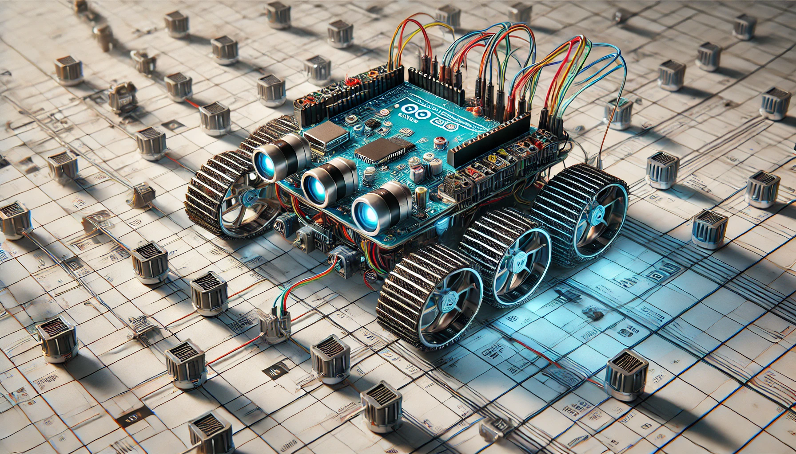

# 

    

#
<h1 align="center">

Grid-solving-robot-Arduino
</h1>

This is a project I have done in my 1st year in university.

## Introduction:

I have made a grid-solving robot that can find its path in a grid and go to the location that it programs to do. I completed this project in the first year of my degree. The main controller that is used is the Arduino Uno board.  I used 4 dc 5v motors for this project and the motor controller is  L298N. Which can provide two 5V outputs. for grid solving and finding paths, I have used 8 IR sensors. using them I was able to  direct the robot to its destination.

#

### Video:

https://github.com/MalakaSupun/Grid-solving-robot-Arduino-/assets/71941117/cb175622-6496-44dc-b00f-223b6e9fc00d

#
### Images:

### The Robot Car:

### Under the robot:

